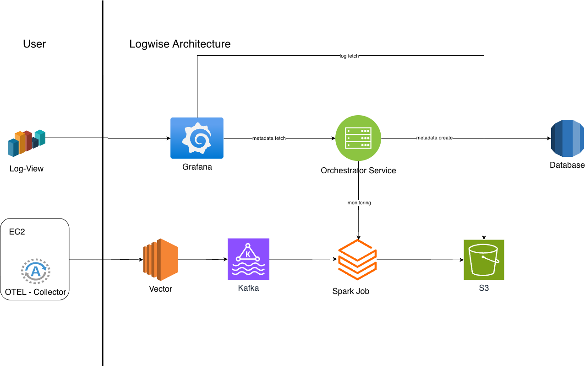

# Architecture Overview

**Log-Central** is a centralized and scalable log processing and viewing system designed to handle high-volume log data efficiently.  
It provides an end-to-end pipeline for log ingestion, transformation, storage, and viewing using modern open-source technologies.


## Architecture Diagram




## Components

### **1. [Vector](/components/vector)**

- Serves as the **entry point** for log ingestion from multiple sources.  
- Performs:
  - **Log enhancement:** Adds metadata and enriches messages.
  - **Key normalization:** Removes problematic keys for compatibility.
  - **Format conversion:** Converts logs into **protobuf** for standardization.
  - **Compression:** Uses **protobuf** format to reduce bandwidth and storage usage.
- Sends processed logs to **Kafka** for ingestion and buffering.

---

### **2. [Kafka](/components/kafka)**

- Provides a **high-throughput**, **fault-tolerant**, and **scalable** log ingestion layer.  
- Vector dynamically creates **Kafka topics** using tags:
  - `environment_name`
  - `component_type`
  - `service_name`
- Enables decoupled, delayed, or batched log processing to support downstream consumers like Spark.


---

### **3. [Apache Spark](/components/spark)**

- Consumes raw logs from Kafka and transforms them into **Parquet** format for:
  - Efficient compression.
  - Faster queries and optimized data scanning.
- Writes output into **Amazon S3** in **Hive-compatible directory structure** using this path pattern:
  ```
  env/service_name/year/month/day/hour/minute
  ```
- The **Orchestrator Service** monitors job health and manages Spark drivers.

---

### **4. [Grafana](/components/grafana)**

- Acts as the **viewing and exploration** layer for logs.
- Displays processed logs in **table format** for easy searching and filtering.
- Enables **custom dashboards** and **interactive filters**.
- Dropdown filters are populated using **metadata** generated by the **Orchestrator Service** from source tags.

---

### **5. [Orchestrator Service](/components/orchestrator)**

- The **central control component** that automates and maintains the overall system state.
- Performs several background operations:
  - **Spark Monitoring:** Keeps Spark drivers healthy and restarts them if needed.
  - **Cleanup:** Removes compacted Spark output files periodically to manage storage.
  - **Metadata Management:** Generates metadata used by Grafana and enforces **log retention policies** on S3 for archival.
- Ensures consistent, automated orchestration across all components.


## Key Advantages

- Fully **automated** architecture.
- Supports **real-time ingestion** and **batch transformation**.
- Uses **S3** for cost-efficient, durable log storage.
- Integrates seamlessly with **Grafana** for log viewing and analytics.
- Provides reliable orchestration and monitoring through the Orchestrator Service.


## Summary

**Log-Central** delivers a comprehensive and automated solution for log aggregation, processing, and viewing.  
By leveraging **Vector**, **Kafka**, **Apache Spark**, **Grafana**, and the **Orchestrator Service**, it ensures reliability, scalability, and visibility across distributed systems while keeping operational overhead minimal.
