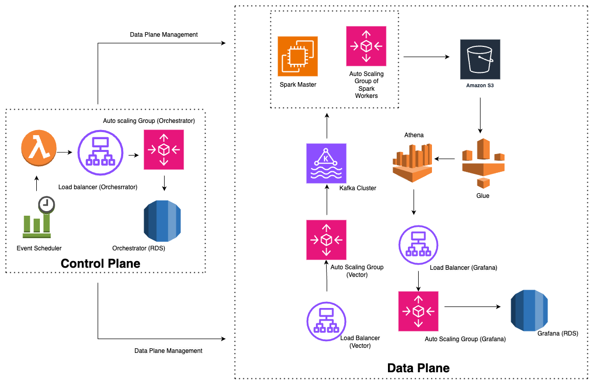

# Production-Ready Self-Hosted Setup Guide

This guide covers production scaling strategies and patterns for Logwise components. For detailed component setup, refer to individual guides:

- [Vector Setup](./vector-setup.md) | [Kafka Setup](./kafka-setup.md) | [Spark Setup](./spark-setup.md)
- [Orchestrator Setup](./orchestrator-service-setup.md) | [Grafana Setup](./grafana-setup.md) | [S3 & Athena Setup](./s3-athena-setup.md)




# Architecture Overview

Logwise is split into two planes:

- **Control Plane** – Orchestrator services that monitor workloads and change capacity (Spark workers, Vector instances, etc.).

- **Data Plane** – Ingestion, processing, storage, and querying of logs.

### Control Plane

**Components**:

1. Event Scheduler – Periodic trigger (e.g. EventBridge / cron).

2. Scheduler Function (Lambda) – Calls Orchestrator HTTP API on a schedule.

3. Load Balancer (Orchestrator) – Stable endpoint for Orchestrator API.

4. Auto Scaling Group (Orchestrator) – Stateless Orchestrator instances behind the LB.

5. Orchestrator DB (RDS / MySQL) – Tenant config, stage history, scaling state.

6. The control plane decides how many workers to run (Spark, optionally Vector) per tenant.

### Data Plane

**Components**:

1. Vector ASG + Load Balancer – Receives OTLP HTTP logs on 4318, writes to Kafka.

2. Kafka Cluster – Durable buffer between ingestion and processing.

3. Spark Master + ASG of Spark Workers – Reads from Kafka, writes Parquet logs to S3.

4. Amazon S3 
   - Long-term log storage.
   - Retention is enforced via S3 lifecycle policies that are **managed by Orchestrator** based on retention settings stored in the Orchestrator DB or default config for non-prod environments.

5. Glue + Athena – Schema and SQL engine over S3 data.

6. Grafana ASG + Load Balancer + Grafana DB (RDS) – UI & dashboards backed by Athena.

# Scaling Strategies
## Vector Scaling Strategies
### Reactive Scaling: High CPU Utilization

**When to Scale**:
- Scale when CPU utilization remains consistently above 70% across Vector instances.

**Scaling Approach**:
- **Horizontal Scaling** – Add additional Vector instances behind the load balancer to distribute workload and maintain performance

**Monitoring Metrics**:
- CPU utilization per instance
- Memory utilization

**Scaling Triggers**:
- **Scale Up**: CPU > 70% for 5 minutes → Add 1 instance
- **Scale Down**: CPU < 40% for 15 minutes → Remove 1 instance

### Proactive Scaling: Anticipated Traffic Increase

**When to Pre-Scale**:
- Planned marketing campaigns or product launches
- Known traffic patterns (e.g., product releases)
- Seasonal traffic increases
- New service onboarding

**Pre-Scaling Strategy**:
1. **Calculate Expected Load**: Estimate logs/second based on historical data
2. **Scale Before Event**: Increase Vector instances 30-60 minutes before expected traffic
3. **Buffer Capacity**: Scale to 150% of expected peak load
4. **Monitor During Event**: Watch metrics closely and scale further if needed
5. **Scale Down After**: Gradually reduce instances after traffic normalizes

## Kafka Scaling Strategies

### Kafka Cluster Scaling: 

Kafka scaling requires careful orchestration to avoid data loss and processing gaps.

#### Step 1: Create New Kafka Cluster

1. **Deploy New Cluster**: Create new Kafka cluster with required broker count
2. **Configuration**: Match or exceed partition count of existing cluster
3. **Network Setup**: Ensure new cluster is accessible from Vector instances
4. **Replication**: Set replication factor to 3 for high availability
5. **Note**: Orchestrator automatically increases topic partitions based on load-test performance

#### Step 2: Switch Vector Traffic to New Cluster

1. **Update Vector Configuration**: Change `bootstrap_servers` to point to new cluster
2. **Rolling Update**: Update Vector instances one at a time (via ASG or manual)
3. **Health Checks**: Verify each Vector instance connects to new cluster
4. **Traffic Verification**: Confirm logs are flowing to new cluster

**Vector Configuration Update**:
```yaml
# New cluster
bootstrap_servers: "kafka-new-1:9092,kafka-new-2:9092,kafka-new-3:9092,---,kafka-new-n:9092"
```

#### Step 3: Wait for Old Cluster to Drain

1. **Monitor Old Cluster**: Check topic offsets and consumer lag
2. **Wait for Zero Traffic**: Ensure no new messages arriving on old cluster
3. **Verify Completion**: Confirm all Vector instances switched to new cluster
4. **Drain Period**: Typically 5-15 minutes depending on traffic patterns

#### Step 4: Submit Spark Jobs for New Cluster

1. **Update Kafka DNS**: Point Spark jobs to new Kafka cluster
2. **Clean Spark State**: Remove old checkpoints and WAL files from S3
3. **Submit New Spark Jobs**: Orchestrator will automatically submit jobs for new cluster
4. **Monitor Processing**: Verify Spark jobs consume from new cluster successfully

**Important Considerations**:
- **No Data Loss**: Old cluster retains data during transition (based on retention policy)
- **Processing Gap**: Small gap may occur during cluster switch (typically < 1 minute)
- **Offset Management**: Spark jobs start from latest offset on new cluster
- **Rollback Plan**: Keep old cluster running for 24-48 hours for rollback if needed

## Spark Worker Auto-Scaling (Orchestrator)

> Note: Orchestrator also keeps Spark jobs alive by re-submitting the driver if it dies.  
> The logic below is only about **worker scaling**, not job restarts.

---

### How Scaling Is Triggered

- After every Spark stage/job completion, a **Stage Listener** calls Orchestrator with:
    - Input/output volumes,
    - Stage timings,
    - Cores used,
    - Status,
    - Tenant info.
- Orchestrator stores this as **stage history** and evaluates whether to scale workers for that tenant.

---

### Inputs Used for Each Scaling Decision

For every evaluation, Orchestrator combines:

- **Recent Spark stage history**
    - Last *N* stages for the tenant.
    - Used to infer throughput and how “busy” the cluster is.

- **WAL (Write-Ahead Log) state**
    - Looks at the latest WAL file:
        - If it’s compacted / non-numeric → **skip scaling** this cycle.
        - Uses the numeric suffix to:
            - Add a **buffer factor** near the end of a WAL window.
            - Temporarily **block downscale** at specific points to stay safe.

- **Spark Cluster config**
    - Minimum and maximum worker counts.
    - Thresholds for:
        - Minimum/maximum upscale step.
        - Minimum/maximum downscale step.
        - Maximum allowed downscale proportion in one shot.

- **Current worker count**
    - Actual number of Spark workers currently running for that tenant.

---

### How the Scaling Decision Is Made

1. Orchestrator uses:
    - Recent stage history,
    - WAL-based buffer,
    - Tenant config  
      to compute an **expected worker count**.

2. The expected count is **clamped** between:
    - `minWorkerCount` and `maxWorkerCount` from tenant config.

3. If:
    - Expected workers are missing/zero,
    - Actual workers are zero, or
    - Expected workers equal actual workers,  
      → Orchestrator **skips scaling**.

---

### When We Downscale

Downscale is applied only if:

- Expected workers \< actual workers, and
- Downscale is enabled (both globally and for this tenant), and
- WAL state does *not* block downscale, and
- The difference is at least the configured **minimum downscale**.

Then Orchestrator:

- Caps the downscale by:
    - A **maximum downscale step**, and
    - A **maximum downscale proportion** (cannot remove more than a certain % in one go).
- Computes a new, lower target worker count.
- Instructs the underlying infra (e.g. ASG/cluster manager) to remove workers down to that target, using lifecycle hooks for graceful shutdown.

If any guard fails, downscale is skipped for that cycle.

---

### When We Upscale

Upscale is applied only if:

- Expected workers \> actual workers, and
- Upscale is enabled for this tenant, and
- The difference is at least the configured **minimum upscale**.

Then Orchestrator:

- Caps the increase by a **maximum upscale step**.
- Computes a new, higher target worker count.
- Instructs the infra to add workers up to that target.

If the difference is too small or limits are hit, upscale is skipped for that cycle.

---

### When Scaling Is Ignored

Even when expected and actual worker counts differ, Orchestrator will **not** change anything if:

- Both upscale and downscale are disabled (globally or via tenant override), or
- WAL is in a compacted/unsafe state, or
- The change is below minimum step thresholds, or
- Clamping to min/max workers results in “no effective change”.

In such cases, the system logs the reason and keeps the worker count as-is.

## S3 Retention Management

In addition to scaling, Orchestrator is responsible for enforcing log retention on S3:

1. **Config Source**: Retention (e.g. retention_days) is stored in the Orchestrator DB per service + environment.

2. **How It Works**: Orchestrator periodically syncs these settings to S3, updating lifecycle rules for the matching prefixes.

3. **Effect**: S3 automatically expires objects older than the configured retention, and any change in DB config is applied without manual cleanup.

## Monitoring and Alerting for Scaling

### Key Metrics to Monitor

**Vector Metrics**:
- CPU utilization per instance
- Memory utilization
- Logs ingested per second
- Kafka publish success rate
- Request queue depth

**Kafka Metrics**:
- Broker CPU and memory
- Disk I/O utilization
- Consumer lag per topic
- Messages in per second
- Network throughput

**Spark Metrics**:
- Worker CPU and memory
- Kafka consumer lag
- Spark job queue depth
- Processing rate (events/second)
- S3 write throughput
- Checkpoint sync status

**Orchestrator Metrics**:
- Spark job submission success rate
- Spark driver monitoring frequency
- Job recovery time
- API response latency

### Scaling Alerts

Set up alerts for:
- **High CPU/Memory**: > 70% for 5 minutes → Consider scaling
- **Kafka Lag**: > 5 minutes → Scale Spark workers
- **Vector Queue**: > 1000 pending requests → Scale Vector
- **Spark Queue**: > 10 pending tasks → Scale Spark workers
- **Processing Delay**: End-to-end latency > 5 minutes → Investigate bottleneck

## Capacity Planning Guidelines

### Small Deployment (< 10K logs/sec)
- **Vector**: 1-2 instances
- **Kafka**: 3 brokers
- **Spark**: 1 Master + 2-3 Workers
- **Orchestrator**: 1 instances
- **Grafana**: 1 instances

### Medium Deployment (10K-100K logs/sec)
- **Vector**: 3-5 instances
- **Kafka**: 3-5 brokers
- **Spark**: 1 Master + 5-10 Workers
- **Orchestrator**: 1 instances
- **Grafana**: 1 instances

### Large Deployment (100K+ logs/sec)
- **Vector**: 5+ instances
- **Kafka**: 5+ brokers
- **Spark**: 1 Master  + 10+ Workers
- **Orchestrator**: 2 instances
- **Grafana**: 1 instances (depends on Users)

## Additional Resources

- [Architecture Overview](../architecture-overview.md)
- [Component Setup Guides](./) - Individual component setup instructions
- [Orchestrator Component Details](../components/orchestrator.md) - Detailed orchestrator behavior
